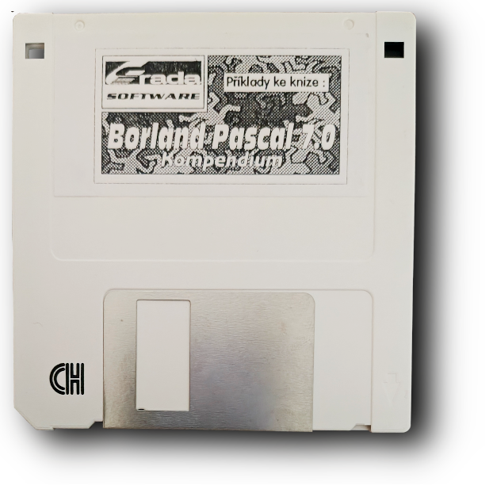

# Příklady ke knize: Borland Pascal 7.0 Kompendium



Zde najdete kopii diskety dodávané ke knize *Borland Pascal 7.0
Kompendium*, která vyšla v roce 1994 v nakladatelství Grada.

* **Kniha:** Borland Pascal 7.0 Kompendium
* **Autoři:**  Pavel Mikula,  Kateřina Juhová,  Jiří Soukenka
* **ISBN10:** 8071690090
* **ISBN:**   9788071690092
* **Vydání:** 1. vyd.
* **Vydáno v**:   1994, Praha

## Obsah repositáře:

* `disk_image` -- Bytový obraz diskety pořízený programem
  [WinImage](https://www.winimage.com/).

* `original_content` -- Soubory zkopírované přímo z diskety.

* `src` -- Zdrojové kódy `*.PAS` příkladů uvedených v knize, na
   disketě jsou v samorozbalovacím archivu `PRTPBP.EXE`. Součástí jsou
   i soubory `*.BGI` s grafickými ovladači Borland Pascalu a jejich
   `*.OBJ` kompilované verze pro jejich linkování ke spouštěcímu
   souboru. České komentáře ve zdrojových kódech jsou ve formátu
   [Bratří
   Kamenických](https://cs.wikipedia.org/wiki/K%C3%B3d_Kamenick%C3%BDch)
   (KEYBCS2).

* `images` -- obrázek diskety a obálky knihy.

## Obsah diskety

Program `HELP.EXE` umožnuje prohlížet nápovědu k příkladům, která
je uložena v souboru `TPBPPR.HLP`, který obsahuje formátovací
sekvence, ale je čitelný i v běžném textovém editoru. Fungování
toho `HELP.EXE` je trochu divný, protože si občas stěžuje na

```
 19775 Mar  2  1993 CTI.MNE    
     7 Dec 27  1995 HELP.CFG   
 88256 Mar  9  1994 HELP.EXE   
 14330 Mar  2  1993 HELPOLD.EXE
 32918 Jun 15  1993 HELPRES.EXE
 18176 Mar  2  1993 HELPSET.EXE
 82480 Jul 24  1993 INSTALL.EXE
   406 Mar  9  1994 INSTALL.FIL
217254 Aug 29  1993 PRTPBP.EXE  -- balík se zdrojovými kódy
659814 Mar  9  1994 TPBPPR.HLP  -- nápověda a popis k příkladům
    99 Mar  7  1992 YYY
```

## Seznam příkladů

### PROGRAM V BORLAND PASCALU A TURBO PASCALU

* Kompatibilita typu řetězec a znak                                  ... [001](./src/_001.PAS)
* Příklad deklarace typu záznam                                      ... [002](./src/_002.PAS)
* Příklad deklarace variantního záznamu                              ... [003](./src/_003.PAS)
* Deklarace typu object a dědění vlastností objektu                  ... [004](./src/_004.PAS)
* Definice množin                                                    ... [005](./src/_005.PAS)
* Definice typu ukazatel                                             ... [006](./src/_006.PAS)
* Deklarace typu procedury                                           ... [007](./src/_007.PAS)
* Použití adresového operátoru                                       ... [008](./src/_008.PAS)
* Definice jednotek                                                  ... [009](./src/_009.PAS)
* Deklarace a použití návěští v programu                             ... [010](./src/_010.PAS)
* Deklarace absolutních proměnných                                   ... [011](./src/_011.PAS)
* Aplikace příkazu přiřazení                                         ... [012](./src/_012.PAS)
* Aplikace příkazu goto                                              ... [013](./src/_013.PAS)
* Aplikace příkazu with                                              ... [014](./src/_014.PAS)
* Klasifikace identifikátorů v příkazu with                          ... [015](./src/_015.PAS)
* Deklarace funkce                                                   ... [016](./src/_016.PAS)
* Různé typy parametrů procedur a funkcí                             ... [017](./src/_017.PAS)
* Demonstrace volání procedur s parametry                            ... [018](./src/_018.PAS)
* Podmíněný překlad v závislosti na využívání myši                   ... [019](./src/_019.PAS)

###  JEDNOTKA SYSTEM

* Aplikace procedur dec a inc                                        ... [020](./src/_020.PAS)
* Užití aritmetických funkcí                                         ... [021](./src/_021.PAS)
* Zaokrouhlování čísel a převody reálných čísel na celá              ... [022](./src/_022.PAS)
* Operace s ordinálními typy                                         ... [023](./src/_023.PAS)
* Použití generátoru náhodných čísel                                 ... [024](./src/_024.PAS)
* Rozklad typu word na byte a výměna byte ve slově                   ... [025](./src/_025.PAS)
* Užití goniometrických funkcí v programu                            ... [026](./src/_026.PAS)
* Základní operace s typem ukazatel                                  ... [027](./src/_027.PAS)
* Užití funkce assigned                                              ... [028](./src/_028.PAS)
* Přidělení a uvolnění paměti procedurami getmem a freemem           ... [029](./src/_029.PAS)
* Přidělení a uvolnění paměti procedurami new a dispose              ... [030](./src/_030.PAS)
* Aplikace procedur mark a release                                   ... [031](./src/_031.PAS)
* Aplikace funkcí pro čtení obsahu registrů procesoru                ... [032](./src/_032.PAS)
* Založení nového typového souboru                                   ... [033](./src/_033.PAS)
* Otevření existujícího typového souboru                             ... [034](./src/_034.PAS)
* Vytvoření textového souboru a zápis textu                          ... [035](./src/_035.PAS)
* Otevření textového souboru a čtení textu                           ... [036](./src/_036.PAS)
* Ošetření chyb vstupu/výstupu v aplikačním programu                 ... [037](./src/_037.PAS)
* Vkládání nových záznamů do diskového souboru                       ... [038](./src/_038.PAS)
* Test existence souboru v adresáři disku                            ... [039](./src/_039.PAS)
* Kopírování libovolného souboru                                     ... [040](./src/_040.PAS)
* Přejmenování a rušení souborů na disku                             ... [041](./src/_041.PAS)
* Čtení a nastavení bloku vyrovnávací paměti souboru                 ... [042](./src/_042.PAS)
* Testování komunikačních kanálů v programu                          ... [043](./src/_043.PAS)
* Operace s adresáři na disku                                        ... [044](./src/_044.PAS)
* Zjištění aktuální délky řetězce                                    ... [045](./src/_045.PAS)
* Výpis všech zobrazitelných znaků                                   ... [046](./src/_046.PAS)
* Aplikace procedury fillchar                                        ... [047](./src/_047.PAS)
* Spojování řetězců kopírování a rušení částí řetězců                ... [048](./src/_048.PAS)
* Časté operace s řetězci                                            ... [049](./src/_049.PAS)
* Převodní funkce typu string na jiný typ a zpět                     ... [050](./src/_050.PAS)
* Formátování číselných výstupů procedurami write a writeln          ... [051](./src/_051.PAS)
* Aplikace procedur break a continue                                 ... [052](./src/_052.PAS)
* Aplikace procedur exit a halt                                      ... [053](./src/_053.PAS)
* Aplikace procedur exclude a include                                ... [054](./src/_054.PAS)
* Aplikace funkcí memavail a maxavail                                ... [055](./src/_055.PAS)
* Aplikace procedury move                                            ... [056](./src/_056.PAS)
* Aplikace funkce sizeof při stanovení paměťových nároků             ... [057](./src/_057.PAS)
* Volání programu s parametry                                        ... [058](./src/_058.PAS)

### JEDNOTKA CRT

* Jednoduché řešení vstupu z klávesnice                              ... [059](./src/_059.PAS)
* Programové řešení vstupu ze souboru                                ... [060](./src/_060.PAS)
* Jednotka procedur a funkcí pro řešení vstupu z klávesnice          ... [061](./src/_061.PAS)
* Testování stisku příznakových kláves                               ... [062](./src/_062.PAS)
* Programování nastavení příznakových kláves                         ... [063](./src/_063.PAS)
* Jednoduchý systém pro práci s okny                                 ... [064](./src/_064.PAS)
* Programování zvukového generátoru                                  ... [065](./src/_065.PAS)
* Zjištění typu monitoru                                             ... [066](./src/_066.PAS)
* Detekce adaptéru ega                                               ... [067](./src/_067.PAS)
* Zjištění zda je připojen adaptér vga                               ... [068](./src/_068.PAS)
* Obecné zjištění typu zobrazovacího adaptéru                        ... [069](./src/_069.PAS)
* Zjištění textového režimu zobrazení                                ... [070](./src/_070.PAS)
* Nastavení aktivní obrazové stránky                                 ... [071](./src/_071.PAS)
* Přímý přístup do obrazové paměti                                   ... [072](./src/_072.PAS)
* Demonstrace přímého přístupu do obrazové paměti                    ... [073](./src/_073.PAS)
* Čtení a zápis atributu do obrazové paměti                          ... [074](./src/_074.PAS)
* Základní jednoduché řešení práce s kurzorem v programu             ... [075](./src/_075.PAS)
* Univerzální rutiny pro práci s textovým kurzorem                   ... [076](./src/_076.PAS)

### JEDNOTKA DOS

* Jednotka procedur pro testování disků                              ... [077](./src/_077.PAS)
* Hledání souborů v adresáři disku a jejich výpis                    ... [078](./src/_078.PAS)
* Čtení a vyhodnocení atributu souboru                               ... [079](./src/_079.PAS)
* Čtení a nastavení verifikace v operačním systému                   ... [080](./src/_080.PAS)
* Operační systém a systémové prostředí                              ... [081](./src/_081.PAS)
* Čtení a nastavení úrovně testu stisku kláves ctrl-break            ... [082](./src/_082.PAS)
* Aplikace procedury exec na spouštění externích procesů             ... [083](./src/_083.PAS)
* Nastavení čítače systémového času                                  ... [084](./src/_084.PAS)

### JEDNOTKA GRAPH

* Inicializace grafického systému s načítáním ovladačů z disku       ... [085](./src/_085.PAS)
* Převod grafických ovladačů do tvaru .obj                           ... [086](./src/_086.PAS)
* Jednotka grafických ovladačů                                       ... [087](./src/_087.PAS)
* Aplikace jednotky ovladačů v programu                              ... [088](./src/_088.PAS)
* Jednotka procedur a funkcí inicializace grafického systému         ... [089](./src/_089.PAS)
* Funkce pro vyhodnocení chyby grafické operace                      ... [090](./src/_090.PAS)
* Aplikace funkce chyba v grafickém programu                         ... [091](./src/_091.PAS)
* Zjištění graf. ovladače režimu a max. počtu barev                  ... [092](./src/_092.PAS)
* Zobrazení všech barevných odstínů aktuální palety                  ... [093](./src/_093.PAS)
* Operace s paletou barev                                            ... [094](./src/_094.PAS)
* Programové řešení změny barvy pozadí                               ... [095](./src/_095.PAS)
* Operace s grafickým ukazatelem v programu                          ... [096](./src/_096.PAS)
* Kreslení grafického bodu a definování jeho barvy                   ... [097](./src/_097.PAS)
* Ukázka práce s výřezy na grafické obrazovce                        ... [098](./src/_098.PAS)
* Demonstrace užití procedur getimage a putimage                     ... [099](./src/_099.PAS)
* Nastavení tloušťky a typu kreslené čáry                            ... [100](./src/_100.PAS)
* Kreslení čar s vlastní definicí stylu                              ... [101](./src/_101.PAS)
* Kreslení čtyřúhelníků                                              ... [102](./src/_102.PAS)
* Kreslení vyplněných čtyřúhelníků                                   ... [103](./src/_103.PAS)
* Kreslení trojrozměrných čtyřúhelníků                               ... [104](./src/_104.PAS)
* Kreslení mnohoúhelníků                                             ... [105](./src/_105.PAS)
* Kreslení kruhových a eliptických výsečí                            ... [106](./src/_106.PAS)
* Využití kompenzace kreslení kruhu v programu                       ... [107](./src/_107.PAS)
* Aplikace procedury floodfill na výplň nepravidelných obrazců       ... [108](./src/_108.PAS)
* Kreslení předdefinovaných výplní obrazců                           ... [109](./src/_109.PAS)
* Definování vlastního způsobu výplně                                ... [110](./src/_110.PAS)
* Jednotka znakových sad                                             ... [111](./src/_111.PAS)
* Demonstrace psaní grafických textů                                 ... [112](./src/_112.PAS)
* Příklad zarovnávání textu na grafické obrazovce                    ... [113](./src/_113.PAS)

### JEDNOTKA STRINGS

* Kompatibilita řetězce a pole znaků                                 ... [114](./src/_114.PAS)
* Vytvoření řetězce v oblasti haldy                                  ... [115](./src/_115.PAS)
* Varianty práce s ukazatelem na řetězec                             ... [116](./src/_116.PAS)
* Alokování a uvolňování paměti pro řetězce                          ... [117](./src/_117.PAS)
* Aplikace vybraných funkcí pro práci s řetězci                      ... [118](./src/_118.PAS)

### OBJEKTOVĚ ORIENTOVANÉ APLIKACE

* Umístění bodu na grafické obrazovce                                ... [119](./src/_119.PAS)
* Příklad definice datového typu object                              ... [120](./src/_120.PAS)
* Varianty přístupu k položkám typu object                           ... [121](./src/_121.PAS)
* Deklarace výchozího objektu lokace                                 ... [122](./src/_122.PAS)
* Vyjádření dedičnosti a srovnání s typem záznam                     ... [123](./src/_123.PAS)
* Deklarace instance typu object                                     ... [124](./src/_124.PAS)
* Definice objektu s metodou a deklarace metody                      ... [125](./src/_125.PAS)
* Deklarace instance objektu lokace a její inicializace              ... [126](./src/_126.PAS)
* Řešení problému bod na obrazovce formou jednotky                   ... [127](./src/_127.PAS)
* Řešení problému bod na obrazovce formou objektu                    ... [128](./src/_128.PAS)
* Aplikace objektu lokace v programu                                 ... [129](./src/_129.PAS)
* Aplikace identifikátoru self                                       ... [130](./src/_130.PAS)
* Definice objektů v modulové jednotce                               ... [131](./src/_131.PAS)
* Aplikace jednotky z příkladu [131](./src/_131.PAS) v programu      ... [132](./src/_132.PAS)
* Deklarace privat uvnitř objektu                                    ... [133](./src/_133.PAS)
* Potlačení přímého přístupu k datovým položkám                      ... [134](./src/_134.PAS)
* Adaptabilita objektů                                               ... [135](./src/_135.PAS)
* Definice objektů s virtuálními metodami                            ... [136](./src/_136.PAS)
* Virtuální metody a polymorfní objekty                              ... [137](./src/_137.PAS)
* Aplikace jednotky z příkladu [137](./src/_137.PAS)                 ... [138](./src/_138.PAS)
* Dynamické objekty a jejich seznam                                  ... [139](./src/_139.PAS)

### UŽITÍ TURBO VISION v PROGRAMU

* Jednotka tvcmds definic konstant cmxxxx                            ... [140](./src/_140.PAS)
* Jednotka tvhelp definic konstant hcxxxx                            ... [141](./src/_141.PAS)
* Aplikace vodorovné a svislé nabídky v programu                     ... [142](./src/_142.PAS)
* Definice objektu ttvstatusline                                     ... [143](./src/_143.PAS)
* Aplikační program s implementací stavového řádku                   ... [144](./src/_144.PAS)
* Práce s informačními okny a obsluha událostí                       ... [145](./src/_145.PAS)
* Doplnění modulové jednotky tvcmds                                  ... [146](./src/_146.PAS)
* Jednotka tvwin definující aplikační okna                           ... [147](./src/_147.PAS)
* Práce s okny v aplikačním programu                                 ... [148](./src/_148.PAS)
* Doplnění jednotky tvhelp o nové konstanty                          ... [149](./src/_149.PAS)
* Doplnění nových nápověd do jednotky tvstline                       ... [150](./src/_150.PAS)
* Dialogová okna v aplikačním programu                               ... [151](./src/_151.PAS)


